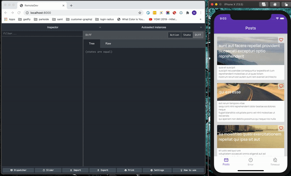

# Flutter Services Example

This is an example application meant to illustrate a few ways to program in Flutter.
I am using a personal state-management approach, 'Services', but don't worry, I don't plan to release it and add to the every growing list of state-management solutions.

This example was made with the following flutter and dart versions:
```sh
Flutter 1.20.4 • channel stable • https://github.com/flutter/flutter.git
Framework • revision fba99f6cf9 (3 weeks ago) • 2020-09-14 15:32:52 -0700
Engine • revision d1bc06f032
Tools • Dart 2.9.2
```

## How do I run the app?

### 'Normal' development mode

```sh
# Get dependencies
flutter pub get

# create the environment configuration file
flutter pub run environment_config:generate

# run the application (development)
flutter run -t lib/builds/dev.dart
```

### 'Remote devtools' development mode

```sh
# Get dependencies
flutter pub get

# create the environment configuration file with remoteDevTools enabled
flutter pub run environment_config:generate --remoteDevTools=true

# install remotedev-server
npm install -g remotedev-server

# run the remotedev-server
remotedev --port 8000

# open a browser and go to `http://localhost:8000`

# run the application (development)
flutter run -t lib/builds/dev.dart
```



### Run the tests

```sh
flutter test
```

## What does this example cover?

- **Custom state-management called 'Services'**
  - relevant code: [services class](https://github.com/gadfly361/flutter_services_example/blob/master/lib/framework/services.dart), [services dispatcher](https://github.com/gadfly361/flutter_services_example/blob/master/lib/services/services_event_dispatcher.dart) 
  - depends on: [provider](https://pub.dev/packages/provider) and [get_it](https://pub.dev/packages/get_it)
  - Notes: While this is inspired by redux, there are a few fundamental differences: 
    - First, the database is an equal citizen to things like shared_preferences or http requests, instead of receiving special, priority treatment.
    - Second, all of the dispatched events are capable of returning an [*actual result*](https://github.com/gadfly361/flutter_services_example/blob/master/lib/pages/posts/overview/body_wrapper.dart#L45) instead of being a void callback. 
    - Third, every event can handle its own [errors](https://github.com/gadfly361/flutter_services_example/blob/master/lib/pages/posts/overview/body_wrapper.dart#L61) and can even [timeout](https://github.com/gadfly361/flutter_services_example/blob/master/lib/pages/posts/overview/body_wrapper.dart#L49) if you want it to.
- **Tests that can track the order of dispatched events**
  - relevant code: [areEventsInExpectedOrder](https://github.com/gadfly361/flutter_services_example/blob/master/test/pages/posts/overview/page_test.dart#L57-L65)
  - depends on: [flutter_test](https://api.flutter.dev/flutter/flutter_test/flutter_test-library.html)
  - Notes: This is made possible because of the custom 'Services' state-management system.
- **Navigation**
  - relevant code: [navigator service](https://github.com/gadfly361/flutter_services_example/blob/master/lib/services/navigator/service.dart), [navigator dispatcher](https://github.com/gadfly361/flutter_services_example/blob/master/lib/services/navigator/service_event_dispatcher.dart)
- **Route transitions**
  - relevant code: [OpenContainer](https://github.com/gadfly361/flutter_services_example/blob/master/lib/pages/posts/overview/widgets_connector/posts_list.dart#L48), [no visible transition](https://github.com/gadfly361/flutter_services_example/blob/master/lib/services/navigator/route_transitions/no_visible_transition.dart) 
  - depends on: [animations](https://pub.dev/packages/animations)
- **Environment variables**
  - relevant code: [environment_config.yaml](https://github.com/gadfly361/flutter_services_example/blob/master/environment_config.yaml) and the generated `lib/environment_config.dart` file that is not version controlled
  - depends on: [environment_config](https://pub.dev/packages/environment_config)
- **Different builds**
  - relevant code: [Dev](https://github.com/gadfly361/flutter_services_example/blob/master/lib/builds/dev.dart) and [Prod](https://github.com/gadfly361/flutter_services_example/blob/master/lib/builds/prod.dart) builds
- **Tapping in to route transitions like didPop with `RouteAware`**
  - relevant code: [RouteAware mixin](https://github.com/gadfly361/flutter_services_example/blob/master/lib/pages/posts/overview/body_wrapper.dart#L22), [didPop](https://github.com/gadfly361/flutter_services_example/blob/e6a518cfe48bef951e6b5981a2cef298e6d028af/lib/pages/posts/overview/body_wrapper.dart#L66), [appRouteObserver](https://github.com/gadfly361/flutter_services_example/blob/e6a518cfe48bef951e6b5981a2cef298e6d028af/lib/app_root.dart#L62) 
- **Custom fonts**
  - relevant code: [Custom fonts](https://github.com/gadfly361/flutter_services_example/blob/master/lib/shared/styles/text_theme.dart)
  - depends on [google_fonts](https://pub.dev/packages/google_fonts)
- **Saving to shared preferences**
  - relevant code: [shared preferences dispatcher](https://github.com/gadfly361/flutter_services_example/blob/master/lib/services/shared_preferences/service_event_dispatcher.dart)
  - depends on: [shared_preferences](https://pub.dev/packages/shared_preferences)
- **Use of custom analysis options** 
  - relevant code: [analysis options](https://github.com/gadfly361/flutter_services_example/blob/master/analysis_options.yaml)
  - depends on: [pedantic](https://pub.dev/packages/pedantic)
- **Pull to refresh** 
  - relevant code: [Pull to refresh widget](https://github.com/gadfly361/flutter_services_example/blob/master/lib/pages/posts/overview/widgets_connector/posts_list.dart#L27), [pull to refresh event handler](https://github.com/gadfly361/flutter_services_example/blob/master/lib/services/pull_to_refresh/service_event_handler.dart)  
  - depends on [liquid_pull_to_refresh](https://pub.dev/packages/liquid_pull_to_refresh)
- **Json serialization**
  - relevant code: [AppDb](https://github.com/gadfly361/flutter_services_example/blob/master/lib/services/db/app_db.dart#L8)
  - depends on: [json_annotation](https://pub.dev/packages/json_annotation), [json_serializable](https://pub.dev/packages/json_serializable)
  - notes: This is needed for http requests as well as using flutter remote devtools
- **Remote dev tools**
  - relevant code: [connect remote dev tools](https://github.com/gadfly361/flutter_services_example/blob/master/lib/builds/dev.dart#L62)
  - depends on: [redux_remote_devtools](https://pub.dev/packages/redux_remote_devtools) 

## Prior Art

Inspirations were taken from the following projects:

- [async_redux](https://pub.dev/packages/async_redux)
- [re-frame](https://github.com/Day8/re-frame)
